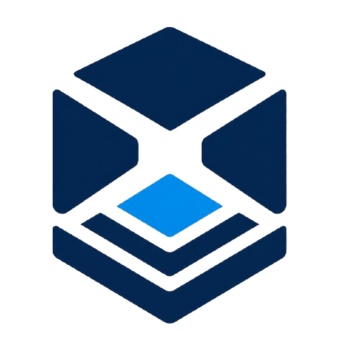
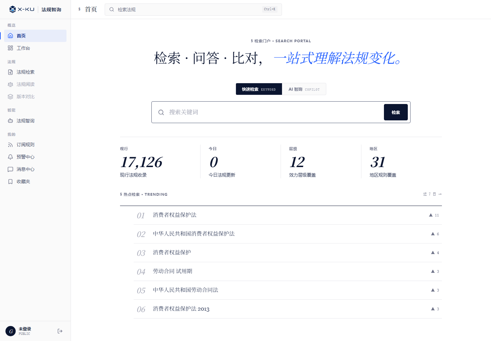
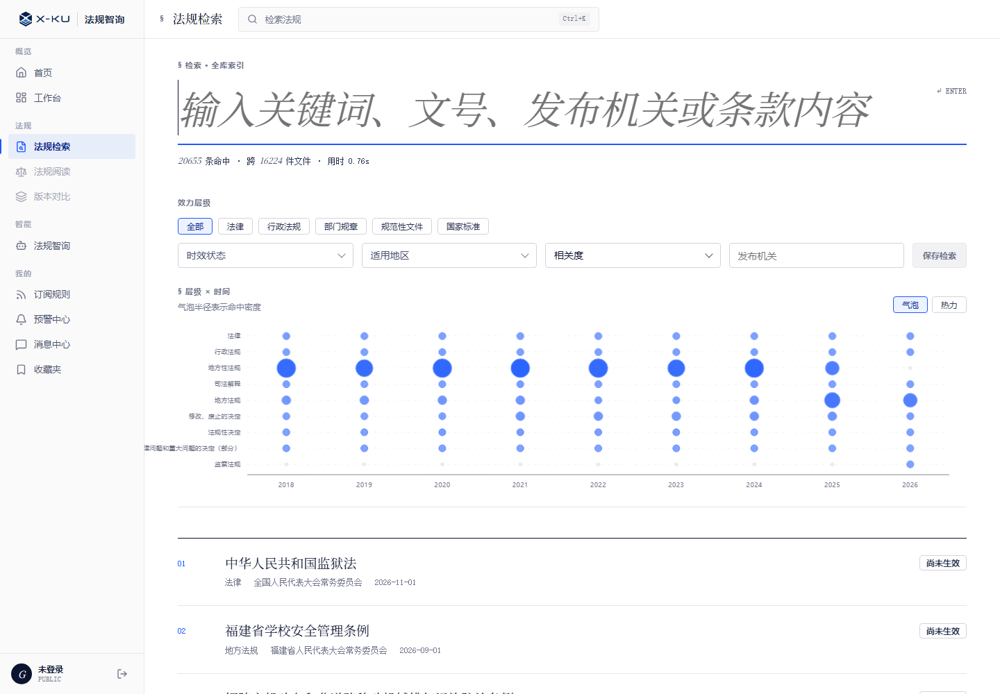
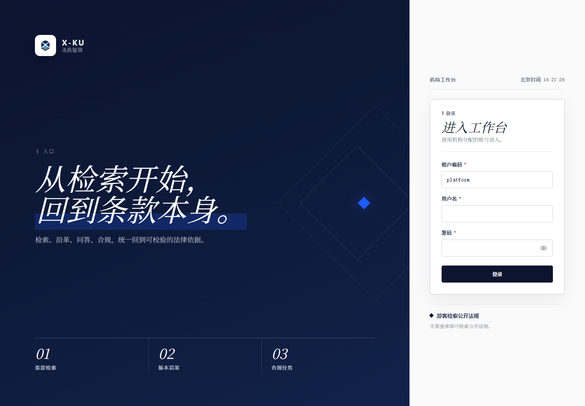
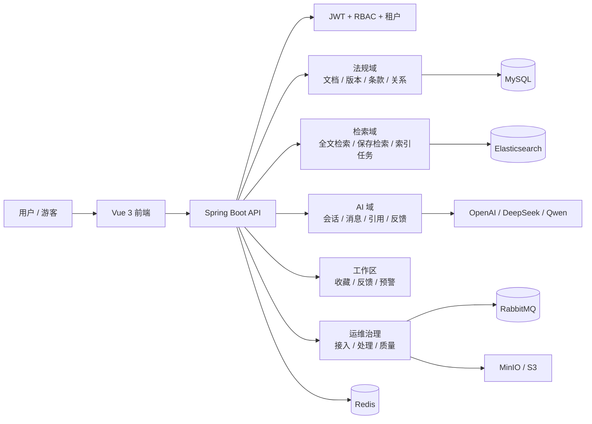
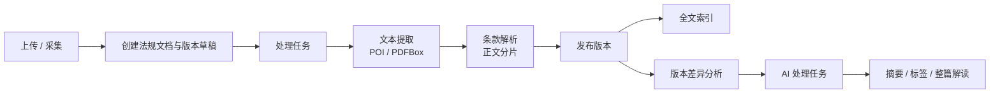

<p align="center">
  
</p>

<h1 align="center">X-KU 法规智询</h1>

<p align="center">
  面向法规检索、版本沿革、条款阅读、订阅预警与可溯源 AI 问答的开源法规知识平台。
</p>

<p align="center">
  <a href="https://law.x-ku.org"><strong>🌐 在线体验</strong></a>
  ·
  <a href="#快速开始"><strong>快速开始</strong></a>
  ·
  <a href="#核心功能"><strong>核心功能</strong></a>
  ·
  <a href="#界面预览"><strong>界面预览</strong></a>
  ·
  <a href="#架构设计"><strong>架构设计</strong></a>
  ·
  <a href="#接口入口"><strong>接口入口</strong></a>
</p>

<p align="center">
  <a href="https://law.x-ku.org">
    
  </a>
</p>

<p align="center">
  
  
  
  
  
  
  
</p>



> ### 🌐 在线体验：**<https://law.x-ku.org>**
>
> 无需本地部署，打开即用——游客可直接检索公开法规，注册登录后体验工作台、订阅预警与可溯源 AI 问答。

X-KU 法规智询不是一个简单的法规列表页。它把法规主数据、全文检索、版本对比、条款结构、订阅预警、AI 问答、RBAC 后台和处理任务治理放在同一套系统中，让用户可以从一个问题出发，找到法规、读懂条款、追踪变化，并把结论落回可验证的依据。

适合企业法务、合规团队、律所、学校、公共服务机构和开发者搭建自己的法规知识库。

## 亮点

- **公开检索入口**：游客可直接检索公开法规，登录后进入工作台和后台治理。
- **条款级知识库**：法规、版本、条款、分类、关系和解读统一建模。
- **版本沿革与对比**：围绕同一法规追踪版本变化，支持条款级差异对比。
- **可溯源 AI 问答**：基于法规检索与引用记录进行流式问答，支持反馈与会话管理。
- **订阅与预警**：按关键词、效力层级、地区、发布机关订阅法规变化。
- **后台治理完整**：RBAC、字典、通知、法规接入、索引任务、AI 任务、质量问题统一管理。
- **工程可落地**：Spring Boot 模块化单体 + Vue 3 + MySQL + Redis + Elasticsearch + Docker Compose。

## 界面预览

<table>
  <tr>
    <td width="50%">
      <strong>检索门户</strong><br />
      
    </td>
    <td width="50%">
      <strong>全库检索</strong><br />
      
    </td>
  </tr>
  <tr>
    <td width="50%">
      <strong>机构工作台入口</strong><br />
      
    </td>
    <td width="50%">
      <strong>法规能力地图</strong><br />
      <br />
      检索、阅读、版本对比、AI 智询、订阅规则、预警中心、消息中心、收藏夹和后台治理共享同一套法规主数据。
    </td>
  </tr>
</table>

## 核心功能

### 检索门户

面向公开访问的法规入口，提供首页概览、关键词检索、热点检索和法规覆盖统计。检索结果可以继续进入法规详情、版本对比、收藏、订阅和 AI 问答链路。

### 法规知识库

X-KU 使用结构化模型描述法规资产：

| 对象 | 说明 |
| --- | --- |
| 法规文档 | 标题、文号、发布机关、效力层级、适用地区、时效状态、主题领域 |
| 法规版本 | 版本号、版本名称、修订类型、发布日期、生效日期、失效日期、发布状态 |
| 法规条款 | 章、节、条、父子条款、正文、排序、义务标记、责任标记 |
| 法规关系 | 引用、修订、废止、解释、冲突等结构化关联 |
| 法规分类 | 主题、地区、行业、效力层级等分类维度 |

### 版本对比

同一法规的不同版本可以进行差异分析，结果面向条款级阅读体验组织，便于查看新增、删除、修改和结构变化。

### AI 法规智询

AI 智询通过 SSE 流式返回回答，并保留会话、消息、引用和用户反馈。模型提供方可配置 OpenAI 兼容接口、DeepSeek、DashScope/Qwen 等。

### 订阅与个人工作区

登录用户可以沉淀自己的法规工作流：

- 保存常用检索
- 创建法规变更订阅规则
- 查看订阅命中的预警
- 接收站内消息
- 收藏法规、条款和检索对象
- 提交法规纠错、AI 回答问题和功能反馈

### 后台与运维治理

后台提供面向平台运营和数据治理的完整入口：

- 用户、角色、权限资源
- 字典类型、字典数据
- 通知创建与投递
- 法规主数据、版本、条款、分类、关系
- 文件上传与法规接入
- 处理任务、AI 任务、索引任务、向量同步任务
- 预警投递、质量问题、审核记录

## 技术栈

| 层次 | 技术 |
| --- | --- |
| 前端 | Vue 3, TypeScript, Vue Router, Pinia, Vite, Axios, Lucide Icons |
| 后端 | Java 17, Spring Boot 3, Spring Security, JWT, MyBatis-Plus, MapStruct |
| 数据库 | MySQL 8, Flyway |
| 缓存 | Redis 7 |
| 检索 | Elasticsearch 8 |
| 队列 | RabbitMQ |
| 文件 | MinIO / S3 兼容对象存储, Apache POI, PDFBox |
| AI | OpenAI 兼容接口, DeepSeek, DashScope/Qwen, SSE |
| 部署 | Docker, Docker Compose |

## 架构设计



## 目录结构

```text
x-ku-law/
├── lr-common/              # 公共返回体、异常、安全上下文、外部客户端抽象
├── lr-module-system/       # 租户、用户、角色、权限、字典、通知
├── lr-module-law/          # 法规、版本、条款、分类、关系、解读、对比
├── lr-module-search/       # 法规检索、保存检索、搜索索引
├── lr-module-ai/           # AI 会话、消息、引用、反馈
├── lr-module-subscription/ # 订阅规则、命中记录、预警
├── lr-module-workspace/    # 收藏、反馈等个人工作区资源
├── lr-module-collect/      # 数据源适配与采集接入基础能力
├── lr-module-compliance/   # 合规域模型
├── lr-server/              # 启动应用、认证、文件、运维、Flyway 迁移
├── x-ku-law-web/           # Vue 3 前端
└── docker-compose.yml      # 本地基础设施与全栈部署编排
```

## 快速开始

### 环境要求

- JDK 17
- Maven 3.8+
- Node.js 18+
- pnpm
- Docker & Docker Compose

### 1. 启动基础设施

```bash
docker compose up -d mysql redis rabbitmq elasticsearch
```

### 2. 启动后端

```bash
mvn spring-boot:run -pl lr-server -am -Dspring.profiles.active=dev
```

后端服务：

| 服务 | 地址 |
| --- | --- |
| API | `http://localhost:8080` |
| Swagger UI | `http://localhost:8080/swagger-ui.html` |
| 健康检查 | `http://localhost:8080/actuator/health` |

### 3. 启动前端

```bash
cd x-ku-law-web
pnpm install
pnpm dev
```

打开：

```text
http://localhost:5173
```

### 4. 登录

Flyway 会为本地开发初始化平台租户和管理员账号：

| 字段 | 值 |
| --- | --- |
| 租户编码 | `platform` |
| 用户名 | `admin` |
| 密码 | `Admin@123` |
| 角色 | `platform_admin` |

```bash
curl -X POST http://localhost:8080/auth/login \
  -H "Content-Type: application/json" \
  -d '{"tenantCode":"platform","username":"admin","password":"Admin@123"}'
```

对外部署前请务必修改默认密码和 `JWT_SECRET`。

## Docker 部署

构建并启动完整服务：

```bash
docker compose up -d --build
```

常用端口：

| 服务 | 地址 |
| --- | --- |
| 应用 | `http://localhost:8080` |
| MySQL | `localhost:3306` |
| Redis | `localhost:6379` |
| RabbitMQ 管理台 | `http://localhost:15672` |
| Elasticsearch | `http://localhost:9200` |

## 配置说明

复制环境变量模板：

```bash
cp .env.example .env
```

常用变量：

| 变量 | 说明 |
| --- | --- |
| `DB_HOST`, `DB_PORT`, `DB_NAME`, `DB_USER`, `DB_PASSWORD` | MySQL 连接 |
| `REDIS_HOST`, `REDIS_PORT`, `REDIS_PASSWORD` | Redis 连接 |
| `ES_URIS` | Elasticsearch 地址 |
| `SEARCH_ENABLED` | 是否启用全文检索 |
| `JWT_SECRET` | JWT 签名密钥 |
| `OSS_ENDPOINT`, `OSS_BUCKET`, `OSS_ACCESS_KEY`, `OSS_SECRET_KEY` | 对象存储 |
| `AI_DEFAULT_PROVIDER` | 默认 AI 提供方 |
| `OPENAI_API_KEY`, `DEEPSEEK_API_KEY`, `DASHSCOPE_API_KEY` | 模型提供方密钥 |
| `VECTOR_ENABLED`, `EMBED_ENABLED`, `EMBED_API_KEY`, `EMBED_DIM` | 向量检索与嵌入 |
| `PROCESS_ENABLED`, `PROCESS_AI_ENABLED` | 法规处理与 AI 处理管线 |
| `COLLECT_ENABLED`, `COLLECT_CRON` | 采集接入定时任务 |

前端环境变量：

```env
VITE_API_BASE_URL=http://localhost:8080
VITE_DEFAULT_TENANT_CODE=platform
```

## 处理管线

X-KU 将上传文件和采集文件汇入同一套接入管线：



结构化管线和 AI 管线彼此分离。你可以先运行全文检索和版本对比，再在模型密钥可用时开启 AI 解读和向量检索。

## 接口入口

| 领域 | 接口 |
| --- | --- |
| 认证 | `POST /auth/login`, `POST /auth/refresh`, `GET /auth/me` |
| 首页 | `GET /home/overview` |
| 检索 | `GET /search/laws`, `GET /search/saved` |
| 法规 | `GET /law/documents`, `GET /law/versions`, `GET /law/articles` |
| 对比 | `GET /law/compare` |
| AI | `POST /ai/messages/ask`, `POST /ai/messages/stop` |
| 订阅 | `GET /subscription/rules`, `GET /subscription/matches` |
| 工作区 | `GET /workspace/favorites`, `GET /workspace/feedbacks` |
| 系统 | `GET /system/users`, `GET /system/roles`, `GET /system/permissions` |
| 运维 | `GET /ops/process-tasks`, `GET /ops/index-tasks`, `GET /ops/quality-issues` |

本地启动后可访问完整接口文档：

```text
http://localhost:8080/swagger-ui.html
```

## 开发与校验

运行后端测试：

```bash
mvn test
```

运行前端类型检查：

```bash
cd x-ku-law-web
pnpm exec vue-tsc --noEmit
```

运行前端 lint：

```bash
cd x-ku-law-web
pnpm exec eslint .
```

## 参与贡献

欢迎围绕以下方向提交改进：

- 法规数据源适配
- 条款解析和版本对比质量
- 搜索相关性和筛选体验
- AI 引用质量和回答反馈
- 后台流程和运维可观测性
- 前端阅读、检索和对比体验

提交 PR 前，请先运行相关后端测试和前端检查。详细流程见 [CONTRIBUTING.md](CONTRIBUTING.md)，社区行为准则见 [CODE_OF_CONDUCT.md](CODE_OF_CONDUCT.md)。

## 安全

如发现安全漏洞，请勿直接提交公开 issue，按 [SECURITY.md](SECURITY.md) 中的方式私下报告。

## 开源协议

本项目基于 [Apache License 2.0](LICENSE) 开源，详见 [LICENSE](LICENSE) 与 [NOTICE](NOTICE)。
